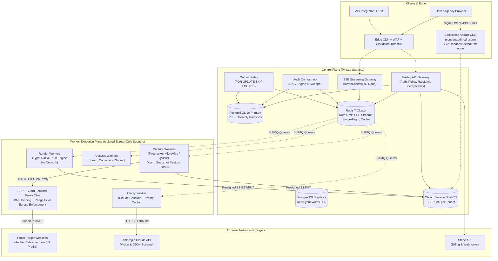
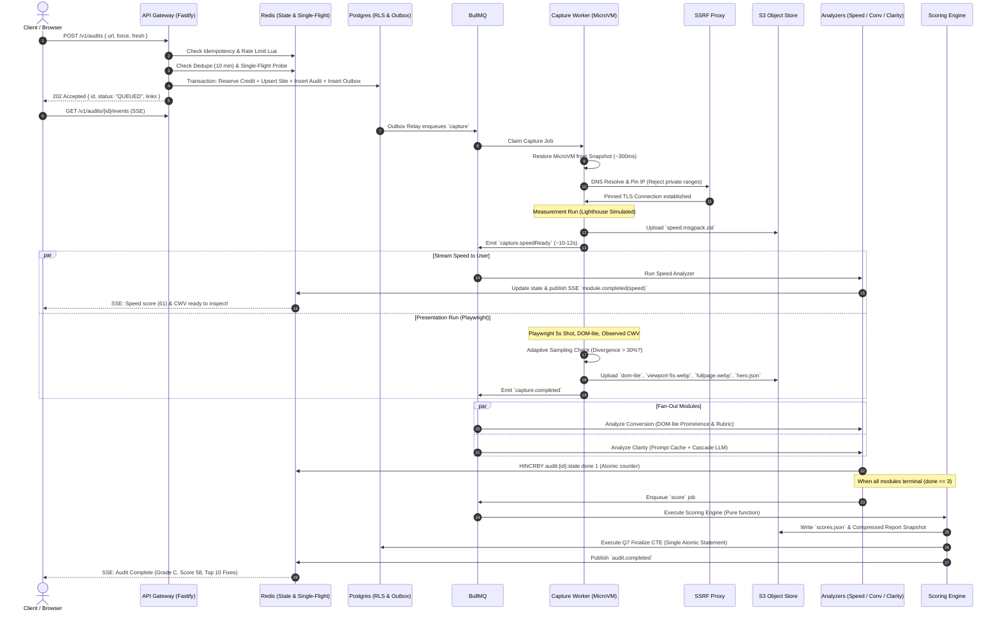
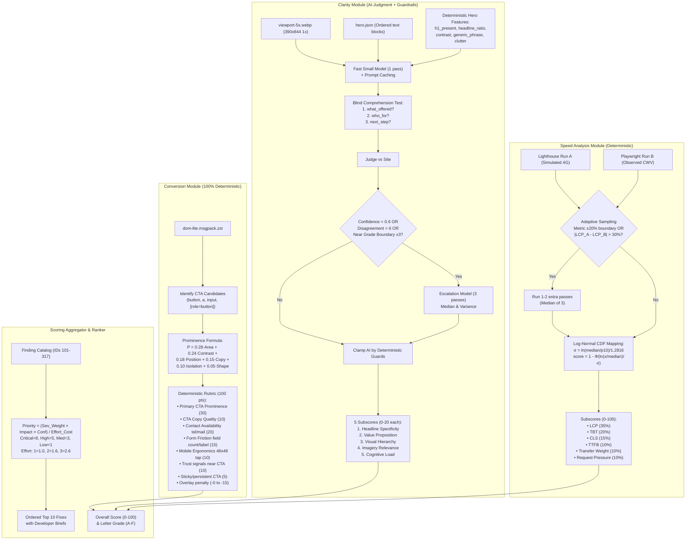
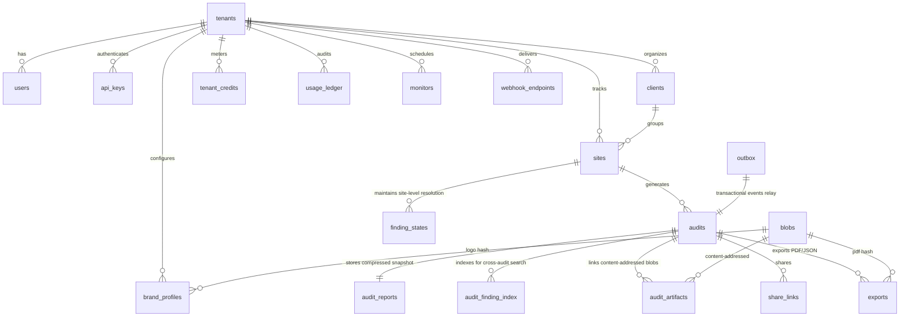

# ConvertAudit AI — Senior Developer Comprehensive System Analysis & Deep Dive

> **Document Status**: Authoritative Senior Architectural Review & Unified System Blueprint  
> **Scope**: Synthesis and critical evaluation of all 12 system specifications (`knowledge.md`, `rules.md`, `architecture.md`, `backend.md`, `database.md`, `schema.sql`, `scoring-spec.md`, `design.md`, `userflow.md`, `security.md`, `performance.md`, `openapi.yaml`).

---

## Executive Architectural Assessment

ConvertAudit AI is engineered around a core asymmetric challenge: **executing untrusted third-party web content at high velocity and sub-dollar unit economics while presenting plain-English, actionable conversion insights to non-technical users and agencies.**

As a senior developer analyzing every line of the specifications, the system demonstrates exceptional engineering maturity. Notably, **`performance.md §0` and `schema.sql` define a critical refinement wave (Supersession Wave)** that addresses the high CPU and storage overhead of initial naive designs, reducing compute from ~50 vCPU-s to ≤14 vCPU-s, storage from ~13 MB to ~0.2 MB per audit, and wall-clock completion from ~67 s to ~22 s p50.

---

## 1. System Topology & Zero-Trust Network Architecture

The architecture enforces a strict physical and logical boundary between the **Control Plane** (multi-tenant orchestration, API, database) and the **Worker Plane** (untrusted browser execution). Workers possess **zero route** back to internal services and can only communicate through S3 object storage (via short-lived presigned URLs) and Redis queue events.

---

## 2. End-to-End Audit State Machine & Asynchronous DAG

Every audit is fully asynchronous: `POST /v1/audits` returns an immediate `202 Accepted` with an embedded timestamp UUIDv7. The audit lifecycle guarantees single-round-trip acceptance, parallelized module execution, and atomic idempotent finalization.

---

## 3. Deep Analysis of the Analysis & Scoring Engine

The scoring system calculates an overall score:
$$\text{Overall} = \text{round}(0.35 \cdot \text{Speed} + 0.35 \cdot \text{Clarity} + 0.30 \cdot \text{Conversion})$$

---

## 4. Database Architecture & Storage Efficiency

The database design in `database.md` and `schema.sql` solves PostgreSQL multi-tenant bloat and scale bottlenecks through 5 key architectural decisions:

1. **UUIDv7 Point-Lookup Optimization**: UUIDv7 embeds a 48-bit millisecond timestamp. The API extracts `created_at` from the UUIDv7 `id` and queries `WHERE created_at = $1 AND id = $2`. PostgreSQL partition pruning immediately eliminates 99% of partitions without scanning.
2. **RLS Without Query Penalties**: Row-Level Security calls `USING (tenant_id = (SELECT app_tenant()))`. Wrapping `app_tenant()` in a scalar sub-select forces PostgreSQL to evaluate it **once as an InitPlan** rather than per-row. Every index leads with `tenant_id`.
3. **Single CTE Finalize Statement (Q7)**: Updates `audits`, inserts `audit_reports`, inserts `audit_finding_index`, updates `sites` read model, deducts `tenant_credits`, inserts `usage_ledger`, and writes to `outbox` in **one single database round trip**. Idempotent via `WHERE status < 10`.
4. **Column Alignment & Smallint Enums**: Columns are sorted by byte size (16B UUIDs $\to$ 8B Bigints $\to$ 4B Integers $\to$ 2B Smallints $\to$ 1B $\to$ Text) to eliminate CPU alignment padding. Enums are `smallint`. Audit row heap size is reduced to ~118 bytes.
5. **Report Snapshot with zstd-dict Compression**: Finding text and evidence are not stored as relational rows. Instead, they are rendered to canonical JSON and compressed via zstd with a monthly pre-trained dictionary (~110 KB), producing a tiny 8–12 KB snapshot per audit.

---

## 5. Security & Multi-Layer SSRF Defense Onion

Because ConvertAudit AI navigates to arbitrary URLs supplied by anonymous users, SSRF and sandbox breakout are the highest-risk vectors. The system employs an 8-layer defense model:

```mermaid
graph TD
    subgraph Layer1["1. Syntactic API Validation"]
        L1["T-01: Schemes http/https only\nT-02: Ports 80/443 only\nT-03: Reject userinfo (@)\nT-04: Normalize, punycode, max 2048 chars"]
    end

    subgraph Layer2["2. SSRF-Guard Proxy DNS Validation"]
        L2["T-05: Resolve DNS independently\nBlock RFC1918, 127.0.0.0/8, 169.254.0.0/16 (Cloud Metadata),\nCGNAT, IPv6 mapped IPv4, link-local"]
    end

    subgraph Layer3["3. Connection Pinning & Anti-Rebinding"]
        L3["T-06: Pin outbound socket to validated IP\nRe-validate on every redirect hop (Max 5 hops)"]
    end

    subgraph Layer4["4. Sandbox MicroVM Boundary"]
        L4["E-01: 120s hard timeout, 1.5GB cgroup RAM\nFirecracker microVM / gVisor runsc\nRead-only rootfs, tmpfs 512MB scratch\nDrop all Linux capabilities, seccomp filters"]
    end

    subgraph Layer5["5. Browser Process Hardening"]
        L5["No --no-sandbox flag\nPermissions default-deny (camera, mic, geo, downloads)\nAuto-dismiss alerts/dialogs\nNo form submission or purchase click (E-15)"]
    end

    subgraph Layer6["6. Worker Network Segmentation"]
        L6["Dedicated isolated node pool\nEgress ONLY via SSRF proxy\nZero route to VPC or cloud metadata service (IMDSv2 hop-limit 1)"]
    end

    subgraph Layer7["7. Cookieless Artifact Domain"]
        L7["Screenshots & PDFs served from convertaudit-cdn.com\nCSP: sandbox; default-src 'none'\nZero session cookies on artifact origin"]
    end

    subgraph Layer8["8. AI Injection & Delimited Token Boundary"]
        L8["A-02: Untrusted page text wrapped in random boundary tokens\nA-04: Model has no tools, no network, no memory\nA-06: AI rewrites filtered against verified page facts"]
    end

    L1 --> L2 --> L3 --> L4 --> L5 --> L6 --> L7 --> L8
```

---

## 6. Comprehensive Cross-Specification Matrix

| Architecture Dimension | Specification Reference | Senior Developer Implementation Requirements |
|---|---|---|
| **API Protocol** | `openapi.yaml`, `backend.md` | OpenAPI 3.1.0, RFC 9457 `application/problem+json`, `Idempotency-Key` (24h Redis replay), keyset pagination (`(created_at, id) < ($1, $2)`). |
| **Tenancy Isolation** | `rules.md §3`, `security.md §3`, `database.md §4` | PostgreSQL RLS enabled & forced; `SET LOCAL app.tenant_id`; cross-tenant requests **MUST return 404, never 403** (prevents ID enumeration). |
| **Worker Sandboxing** | `rules.md §2`, `security.md §5`, `performance.md §3` | Ephemeral Firecracker microVMs restored from pre-warmed snapshot (~300ms); CoW memory; 390×844 Android DPR 3 (captured @ 1x for WebP); 4× CPU slowdown; Slow 4G. |
| **Core Web Vitals** | `knowledge.md §3.2`, `scoring-spec.md §2` | LCP (p10 2.5s, median 4.0s), TBT (p10 200ms, median 600ms), CLS (p10 0.10, median 0.25), TTFB (p10 800ms, median 1.8s). CrUX field data shown alongside, never blended. |
| **Clarity Evaluation** | `scoring-spec.md §3`, `backend.md §8.3` | Blind comprehension test (what/who/next step) + 5 subscores (0–20). Reconciled with deterministic DOM signals. Primary model with escalation cascade on low confidence. |
| **Conversion Rubric** | `scoring-spec.md §4` | Prominence formula $P = 0.28A + 0.24C + 0.18Pos + 0.15Copy + 0.10Iso + 0.05Shape$. 100-pt rubric checking primary CTA, contact paths, form fields, tap targets. |
| **PDF Generation** | `performance.md §9`, `design.md §7` | **Typst native Rust compiler** (supersedes headless Chromium); consumes first-party `.typ` templates + JSON data; 0.1–0.3 vCPU-s; vector annotations; zero browser attack surface. |
| **Outbox & Events** | `architecture.md §4`, `backend.md §6`, `schema.sql` | `outbox` table with `FOR UPDATE SKIP LOCKED` relay. BullMQ job deduplication using `jobId = audit_id`. Redis Streams for SSE reconnection (`Last-Event-ID`). |

---

## 7. Senior Developer Recommendations & Guardrails

1. **Enforce Supersession Rigor**: Ensure engineering teams do not implement deprecated patterns (e.g. running 3 full throttled Lighthouse passes on every run or rendering PDFs with headless Chromium). `performance.md` and `schema.sql` are the authoritative implementation standards.
2. **Maintain Strict Pure Functions**: Keep `packages/domain` completely free of I/O. Scoring, rubric evaluation, prominence calculation, and priority formulas must run as 100% unit-tested pure functions.
3. **CI Plan-Gating**: Keep the CI SQL explain-plan linter active to prevent developers from querying partitioned tables without bounded `created_at` predicates.
4. **Golden Set Guard**: Run the 600-site golden regression set on every model, prompt, Chromium, or scoring code change. Block any release causing >3 points drift on deterministic modules or >5 points on Clarity.

---
*Authored by Senior Engineering Architect | ConvertAudit AI Platform*
